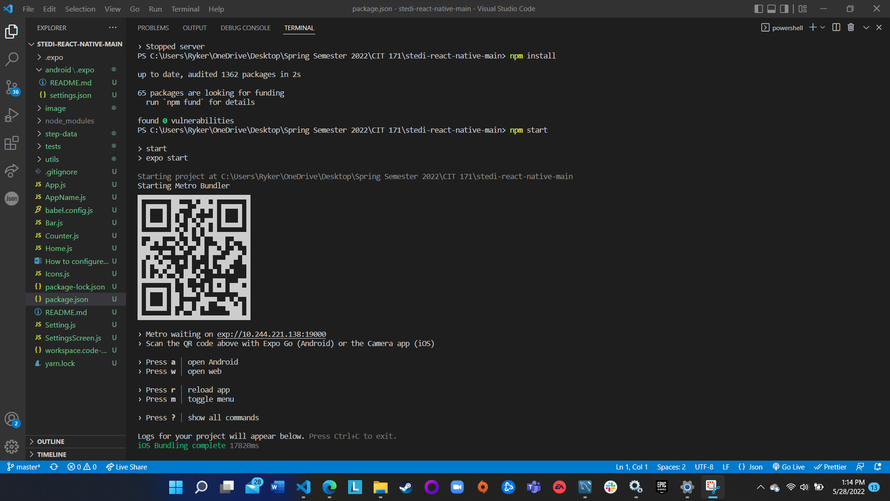
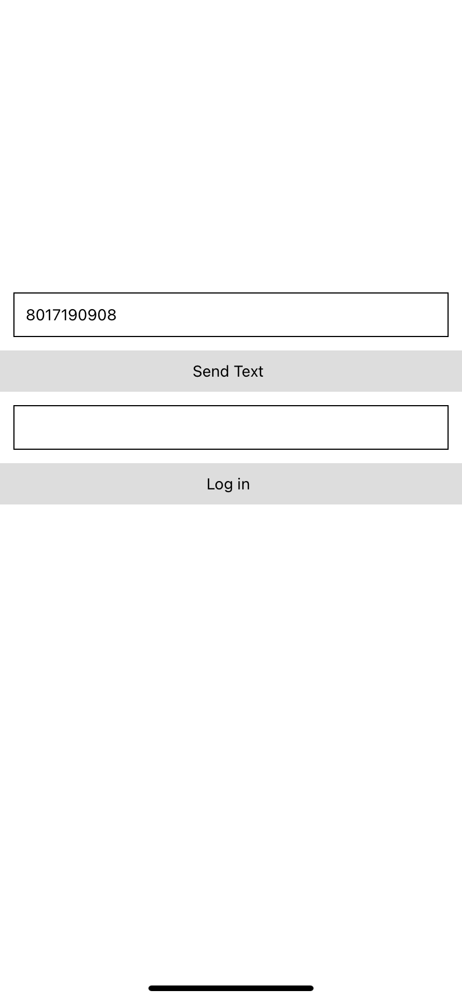
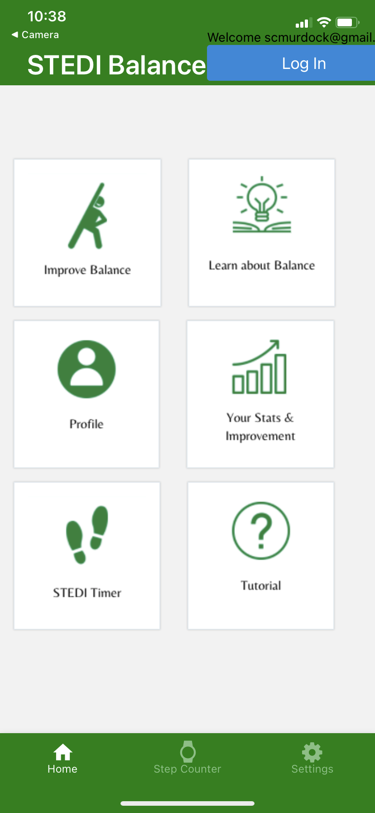

# STEDI Build Steps

`git clone https://github.com/BYUI-CIT-262/stedi-content`

`cd stedi-content`

`Docker build . -t stedi-content`

`Docker run stedi-content -p 8080:80`

Then open http://localhost:8080

# Scan the QR Code in the Terminal

  

# Enter Your Phone Number & Request an Authentication Code

  

# Now, You Should See Yourself LoggedIn to the Application

  

